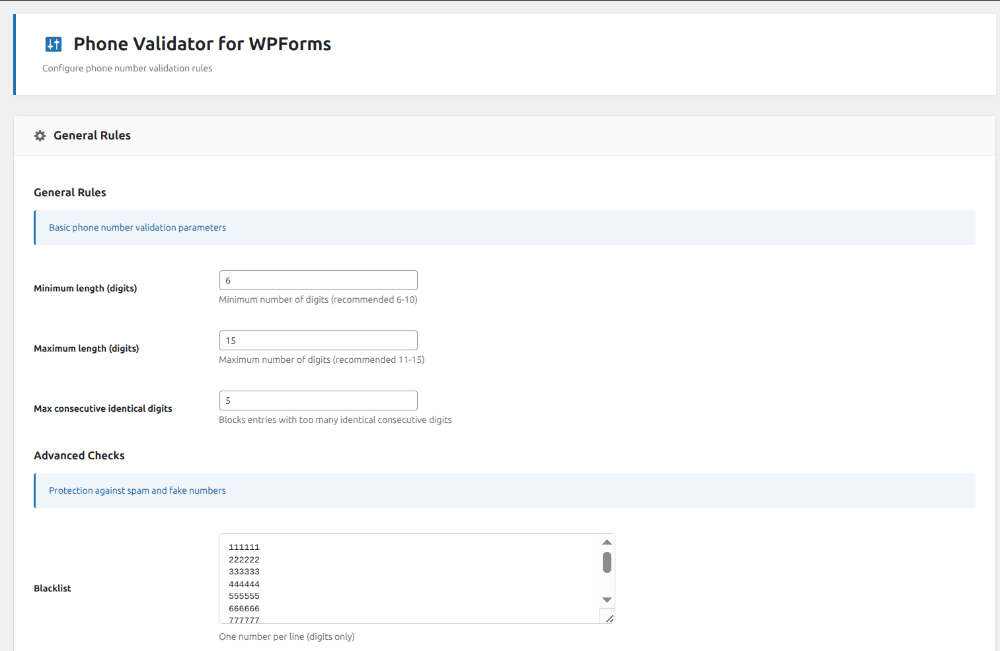
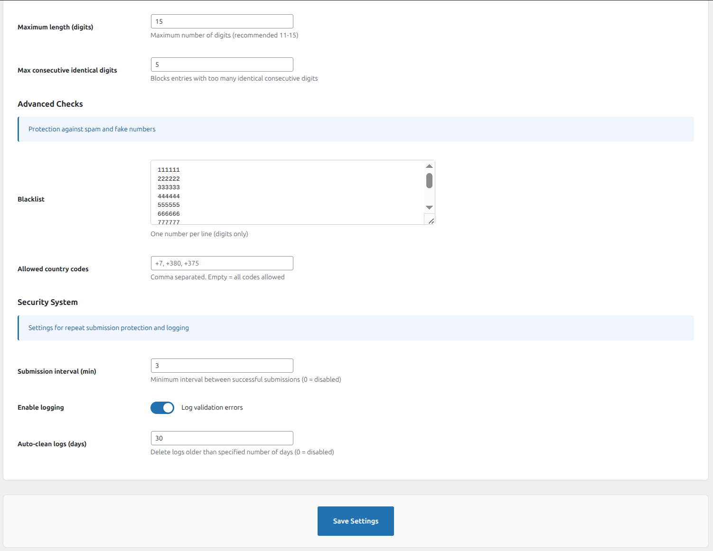
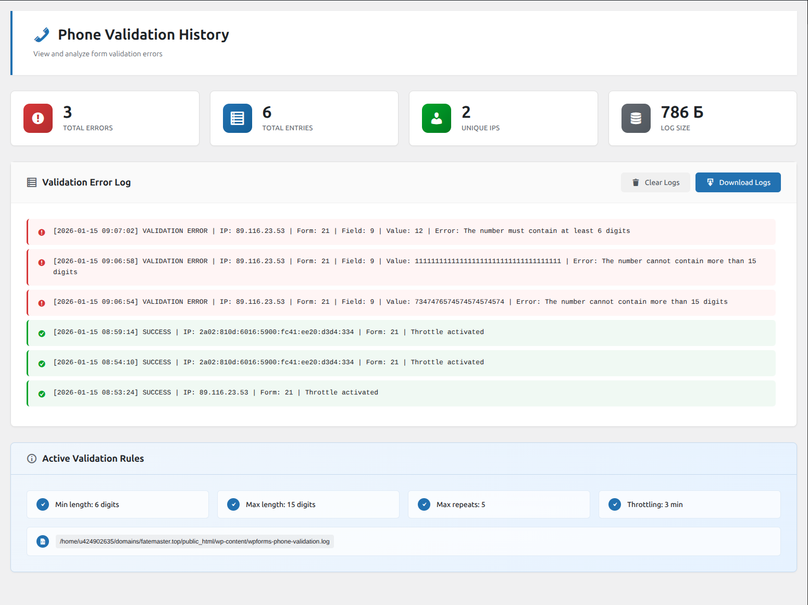

# Phone Validator for WPForms

Advanced phone number validation, country code checks, and intelligent anti-spam protection for WPForms.

---

## 📋 Description

Add professional phone number validation to your WPForms to block spam and ensure data quality. This plugin works as an addon for **WPForms (Lite & Pro)**.

It validates the phone number format, checks length, detects repetitive spam patterns, and can restrict input to specific country codes. Additionally, it includes a throttling system to block spam bots from flooding your forms.

---

## ✨ Key Features

- **Length Validation:** Set minimum and maximum digit counts for phone numbers
- **Anti-Spam Protection:** Automatically blocks numbers with repetitive digits (e.g., 1111111)
- **Blacklist:** Built-in blocklist to ban specific spam numbers or patterns
- **Country Codes:** Restrict input to specific country codes only (e.g., +7, +380, +44)
- **Throttling:** Limit submissions from one IP address within a set timeframe
- **Detailed Logging:** Track all validation errors and blocked attempts in a clean, searchable log
- **Auto-Cleanup:** Automatically deletes old logs to keep your database optimized

---

## 🚀 Installation

1. Download the plugin from this repository
2. Upload to `/wp-content/plugins/phone-validator-for-wpforms` directory
3. Activate the plugin through the WordPress **Plugins** screen
4. Go to **Phone Validator** in the admin menu to configure your validation rules
5. Done! Your WPForms are now protected

---

## 🔧 How It Works

The plugin automatically hooks into WPForms phone fields and validates input before submission. If the number is invalid or blacklisted, the form shows a user-friendly error message and blocks the entry. No complex configuration required.

---

## ❓ FAQ

### Does it work with the free version of WPForms?
Yes, it works perfectly with both **WPForms Lite** and **WPForms Pro**.

### Can I block specific numbers?
Yes, go to the Settings page and add numbers to the Blacklist field (one per line).

### Where can I see blocked attempts?
Check the **"Validation History"** to see a detailed log of all blocked submissions and validation errors.

### Does it slow down my site?
No, validation runs only when a form is submitted. Logs are stored in a file (not database), ensuring optimal performance.

---

## 📸 Screenshots

*Configure length limits, country codes, and spam protection rules*

*View logs of blocked numbers, errors, and successful submissions*

---

## 📝 Changelog

### 1.0.0
- Initial public release
- Includes advanced validation, spam protection, and logging features

---

## 🛠️ Requirements

- **WordPress:** 5.6+
- **PHP:** 7.4+
- **WPForms:** 1.6+ (Lite or Pro)

---

## 📄 License

This plugin is licensed under the [GPLv2 or later](https://www.gnu.org/licenses/gpl-2.0.html).

---

## 👤 Author

**advertsales**  
📧 Support: [Telegram](https://t.me/advertsales)

---

## ⭐ Support

If you find this plugin useful, please give it a star on GitHub!
